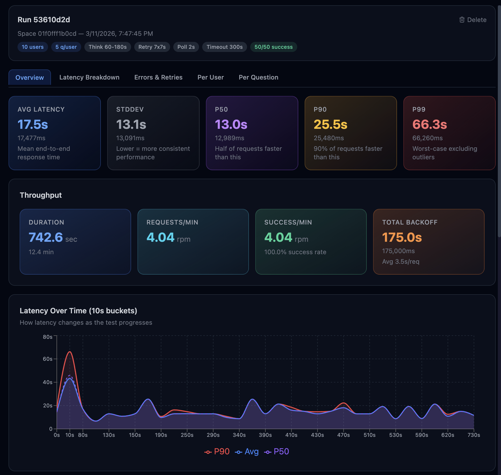
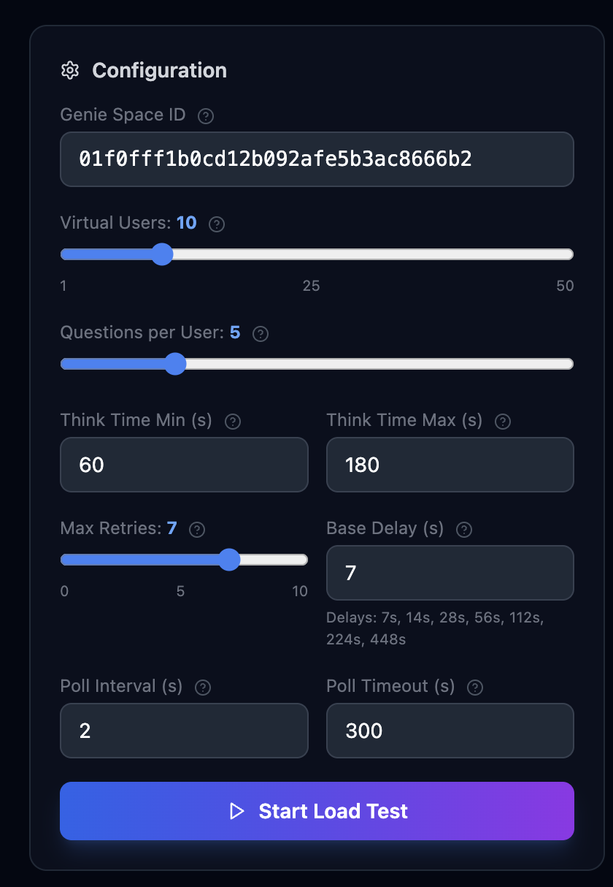
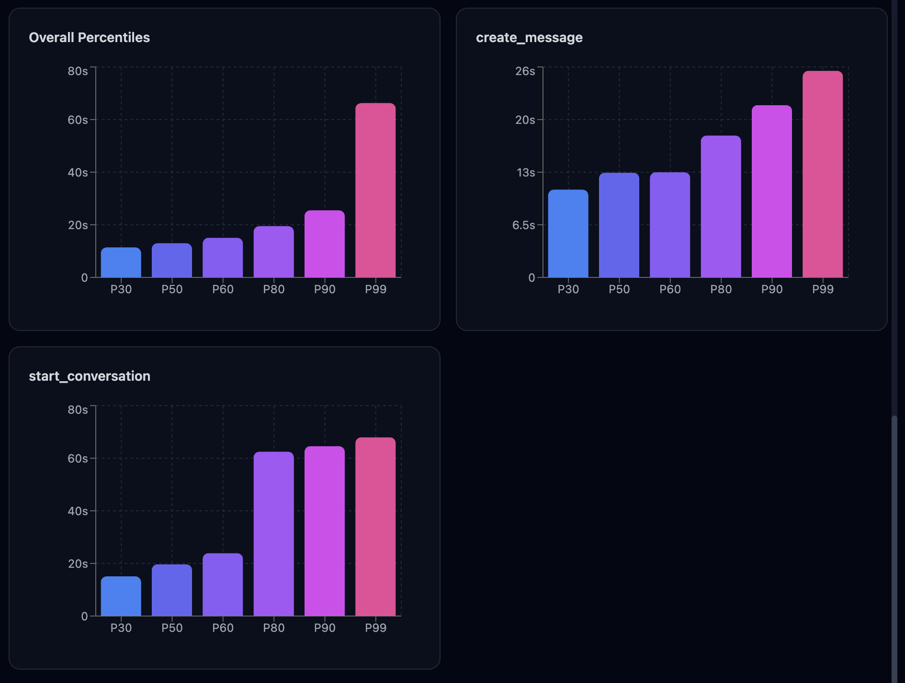
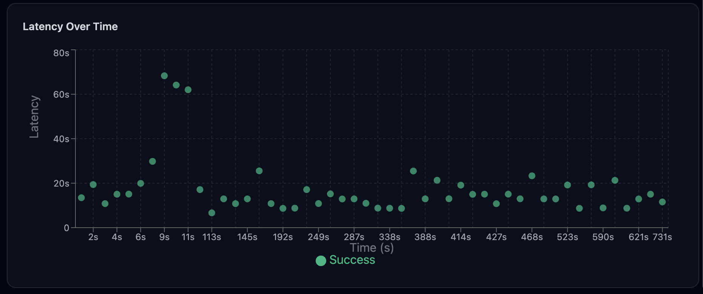
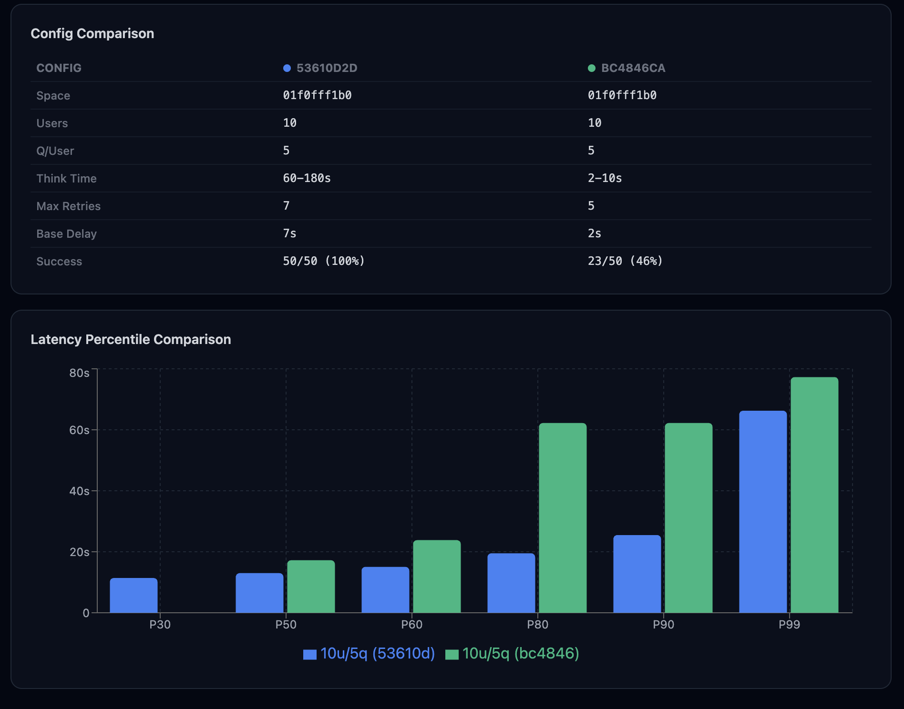
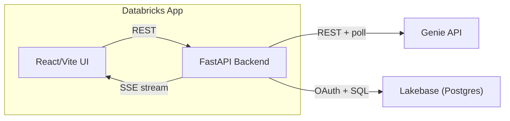

# Genie Throughput Tester

A Databricks App for benchmarking [Genie API](https://docs.databricks.com/en/genie/index.html) concurrency and latency. Simulate virtual users sending questions to a Genie Space and get detailed performance metrics in real-time.



## Why Use This

When rolling out AI/BI Genie Spaces to your organization, you need to understand how they perform under load. This tool answers questions like:

- **How many concurrent users can my Genie Space handle?**
- **What's the end-to-end latency at P50, P90, P99?**
- **Which questions are slow and need instruction tuning?**
- **How does performance change as I scale from 5 to 50 users?**

## Features

- **Concurrent user simulation** — 1 to 50 virtual users, each sending multiple questions
- **Real-time monitoring** — Live latency chart and progress via Server-Sent Events
- **Detailed metrics** — Latency percentiles (P30-P99), standard deviation, TTFR vs polling breakdown, throughput, error analysis
- **Concurrency curve** — Visualize how latency changes over the course of a test (10-second time buckets)
- **Per-request status tracking** — Genie API completion status recorded for every request
- **Question bank** — Manage reusable question sets per Genie Space (single or bulk import)
- **Configurable retry & polling** — Tune max retries, exponential backoff, poll interval, and poll timeout per test
- **Run history** — Side-panel layout with full config display, persistent run list, and detail view
- **Run comparison** — Select multiple runs and compare latency distributions with a config comparison table
- **Run deletion** — Delete individual runs or bulk-delete selected runs from the history
- **Per-question insights** — Identify slow questions with response type badges for instruction tuning
- **Help tooltips** — Hover over any config field for an explanation of what it does

## Quick Start

### Prerequisites

- [Databricks CLI](https://docs.databricks.com/en/dev-tools/cli/install.html) v0.229.0+
- [Node.js](https://nodejs.org) 18+ and npm
- Python 3.8+
- A Databricks workspace with Genie Spaces and Lakebase enabled

### Setup (one-time)

Full instructions in [docs/setup.md](docs/setup.md). Summary:

```bash
# 1. Authenticate
databricks auth login --host https://your-workspace.cloud.databricks.com --profile my-profile

# 2. Create a Lakebase instance (stores test results)
databricks database create-database-instance genie-load-test \
    --capacity=CU_1 --enable-pg-native-login --no-wait --profile my-profile

# 3. Create the Databricks App
databricks apps create my-genie-tester --description "Genie Throughput Tester" --profile my-profile

# 4. Bind Lakebase to the app (via UI)
#    Compute > Apps > my-genie-tester > Edit > Add Resource > Database
#    Select "genie-load-test", permission: "Can connect and create"

# 5. Update app.yaml with your Lakebase instance name
#    (edit DB_INSTANCE_NAME value)
```

### Deploy

```bash
./deploy.sh <app-name> <profile>

# Example:
./deploy.sh my-genie-tester my-profile
```

The script:
1. Validates prerequisites (CLI tools, auth, app exists, no pending deploy)
2. Builds the React frontend locally
3. Stages and uploads only runtime files (10 files, ~700KB)
4. Deploys the app and waits for completion

### Redeploy after changes

```bash
./deploy.sh my-genie-tester my-profile
```

## Usage

### Finding Your Genie Space ID

The Space ID is in the URL when you open a Genie Space in the Databricks UI:

```
https://<workspace>.cloud.databricks.com/genie/rooms/<space-id>
```

You can also find it on the Genie Space settings page under **Space details**.

### Running a Test



1. **Open the app** and enter a Genie Space ID
2. **Add questions** to the question bank (single or bulk import, one per line)
3. **Configure the test:**
   - Virtual Users (1-50)
   - Questions per User (1-20)
   - Think Time (min/max seconds between questions)
   - Max Retries and Base Delay for 429 backoff
   - Poll Interval and Poll Timeout for Genie response checking
4. **Click Start Load Test** and watch results stream in
5. **Analyze results** using the tabbed detail view:
   - **Overview** — Percentiles, throughput, latency scatter plot
   - **Latency Breakdown** — Time to First Response vs Polling duration
   - **Errors & Retries** — Status distribution, retry counts, backoff time
   - **Per User** — Individual virtual user performance
   - **Per Question** — Question-level latency for instruction tuning
6. **Compare runs** — Check multiple runs in the history panel to compare side-by-side

## Interpreting Results

### Key Metrics

| Metric | What It Measures | What to Look For |
|--------|-----------------|-----------------|
| **Latency (end-to-end)** | Total time from sending a question to getting a final answer | P50 under 15s is typical; P99 over 60s warrants investigation |
| **TTFR (Time to First Response)** | Time for the Genie API to accept the request and return a conversation/message ID | High TTFR at scale = API is throttling or queuing your requests |
| **Polling** | Time Genie spends computing the answer after accepting the request | High polling = the question is genuinely complex or needs instruction tuning |
| **Retry Count** | How many times a request was retried due to HTTP 429 (rate limit) | High retries mean the Space is hitting API rate limits, not that questions are slow |
| **Backoff Time** | Total time spent waiting between retries | Tracked separately from latency — a request with 10s backoff and 5s latency shows `latency_ms = 5000` |





### How to Use Each Tab

- **Overview** — Start here. If P90 is 3x the P50, you have a long tail worth investigating in the per-question view.
- **Latency Breakdown** — Compare TTFR vs Polling. If TTFR dominates at high concurrency, the bottleneck is API admission, not query execution.
- **Errors & Retries** — High retry counts with eventual success means backoff is working. High error rates mean the Space may be misconfigured or overloaded.
- **Per User** — Check for outlier users. If one virtual user is consistently slower, it may have hit a rate limit early and cascaded delays through its conversation.
- **Per Question** — The most actionable tab. Questions with P90 latency 3x+ above average are candidates for Genie instruction tuning (add examples, simplify scope, or refine table instructions).

### Comparing Runs



Use the History tab to check 2+ runs and click **Compare**. Common patterns:

- **Linear degradation** (5 users → 10 users doubles latency) — normal; the Space scales predictably.
- **Cliff** (10 users fine, 15 users collapse) — you've found the concurrency ceiling. Consider splitting workloads across multiple Genie Spaces.
- **Same latency, more retries** — the Space handles the load but rate limiting kicks in. Increasing backoff base delay can smooth this out.

## Architecture

See [docs/architecture.md](docs/architecture.md) for a detailed technical overview with diagrams.



## Project Structure

```
genie-loadtest/
├── app.yaml                 # Databricks App runtime config
├── requirements.txt         # Python dependencies
├── deploy.sh                # Build + deploy script
├── .gitignore
├── backend/
│   ├── main.py              # FastAPI app, API routes, SSE streaming
│   ├── db.py                # Lakebase connection pool with OAuth
│   ├── genie_client.py      # Genie API client with retry logic
│   ├── test_engine.py       # Virtual user orchestration engine
│   └── static/              # Built frontend (served by FastAPI)
├── frontend/
│   ├── src/
│   │   ├── App.jsx          # Main app with config panel
│   │   ├── components/      # React components (15 modules)
│   │   └── utils/api.js     # API client + SSE helper
│   ├── package.json
│   └── vite.config.js
└── docs/
    ├── setup.md             # Complete setup guide
    └── architecture.md      # Technical architecture doc
```

## Test Parameters

| Parameter | Range | Default | Description |
|-----------|-------|---------|-------------|
| Virtual Users | 1-50 | 10 | Concurrent simulated users |
| Questions/User | 1-20 | 5 | Questions each user sends |
| Think Time Min | 0-60s | 2s | Minimum pause between questions |
| Think Time Max | 0-60s | 10s | Maximum pause between questions |
| Max Retries | 0-10 | 5 | Retry attempts on 429 errors |
| Base Delay | 0.5-30s | 2s | Exponential backoff base (delays: 2s, 4s, 8s, 16s, 32s) |
| Poll Interval | 0.5-10s | 2s | How often to check if Genie finished answering |
| Poll Timeout | 30-600s | 300s | Max time to wait for a single answer before timeout |

## API Reference

### Test Lifecycle

#### `POST /api/test/start` — Start a load test

Request body:
```json
{
  "genie_space_id": "01ef1234-abcd-5678-...",
  "num_users": 10,
  "questions_per_user": 5,
  "think_time_min_sec": 2.0,
  "think_time_max_sec": 10.0,
  "max_retries": 5,
  "retry_base_delay": 2.0,
  "poll_interval_sec": 2.0,
  "max_poll_time_sec": 300
}
```

Response: `{ "run_id": "uuid", "status": "running" }`

#### `POST /api/test/{run_id}/cancel` — Cancel a running test

Response: `{ "run_id": "uuid", "status": "cancelled" }`

#### `GET /api/test/{run_id}/stream` — SSE stream of live progress

Returns a Server-Sent Events stream with three event types:

| Event | When | Payload |
|-------|------|---------|
| `progress` | Every ~1 second while running | `{ status, total, completed, successful, failed, new_results[] }` |
| `done` | Test reaches terminal state | `{ status }` — one of `completed`, `failed`, `cancelled` |
| `error` | Run not found | `{ error }` |

Each item in `new_results[]`: `{ request_id, user_id, question, request_type, latency_ms, status, timestamp }`

#### `GET /api/test/runs?limit=20` — List historical runs

Response: array of run summary objects (run_id, genie_space_id, num_users, questions_per_user, started_at, status, total/successful/failed counts).

#### `GET /api/test/{run_id}/results` — Full results with all metrics

Response:
```json
{
  "run": { /* test_runs row */ },
  "overall": { "avg_ms", "stddev_ms", "p30", "p50", "p60", "p80", "p90", "p99", "min_ms", "max_ms" },
  "by_type": [ /* same shape as overall, one per request_type */ ],
  "latency_breakdown": [ { "request_type", "avg_ttfr_ms", "avg_polling_ms", "p50_ttfr_ms", "p90_ttfr_ms", ... } ],
  "throughput": { "total_requests", "successful", "failed", "duration_sec", "requests_per_min", "total_backoff_ms" },
  "error_breakdown": [ { "status", "count", "avg_retries", "total_retries", "total_backoff_ms", "avg_latency_ms" } ],
  "per_user": [ { "virtual_user_id", "total_requests", "successful", "failed", "avg_latency_ms", ... } ],
  "per_question": [ { "question", "times_asked", "avg_latency_ms", "stddev_ms", "p50_ms", "p90_ms", "response_type", ... } ],
  "concurrency_curve": [ { "time_bucket_sec", "requests", "successful", "avg_latency_ms", "p50_ms", "p90_ms" } ],
  "requests": [ /* full request log: all test_requests rows, includes response_type */ ]
}
```

#### `GET /api/test/compare?run_ids=id1,id2` — Compare runs

Requires 2+ comma-separated run IDs. Response: array of `{ run: { run summary with full config }, stats: { avg_ms, p30..p99, total, successful, failed } }`.

#### `DELETE /api/test/{run_id}` — Delete a test run

Deletes the run and all its request data (cascading). Response: `{ "status": "deleted" }`

### Question Bank

| Method | Endpoint | Body | Response |
|--------|----------|------|----------|
| GET | `/api/questions?genie_space_id=X` | — | `[ { id, genie_space_id, question, created_at } ]` |
| POST | `/api/questions` | `{ genie_space_id, question }` | `{ id, status: "created" }` |
| POST | `/api/questions/bulk` | `{ genie_space_id, questions: ["q1","q2",...] }` | `{ ids: [...], count }` |
| DELETE | `/api/questions/{id}` | — | `{ status: "deleted" }` |

## Tech Stack

- **Frontend:** React 18, Vite, Tailwind CSS, Recharts, Lucide Icons
- **Backend:** FastAPI, SSE-Starlette, httpx, Pydantic
- **Database:** Lakebase (Databricks managed Postgres 16)
- **Auth:** Databricks SDK OAuth (auto-refreshing tokens)
- **Genie API:** start-conversation + create_message with polling

## Known Limitations

- **Max 50 virtual users** — all run on a single Python asyncio event loop in one process. For heavier loads, deploy multiple app instances targeting different Genie Spaces.
- **One test at a time** — starting a second test while one is running works, but both share the same event loop and Genie API rate limits. Results may interfere.
- **Polling timeout** — if a Genie message doesn't reach a terminal state within the configured poll timeout (default 300s / 5 minutes), it's marked as `timeout`. Configurable per-test via the UI.
- **Question recycling** — if the question bank has fewer questions than `questions_per_user`, questions are repeated to fill the quota. This is intentional (tests the same question under concurrent load) but means the per-question view may show inflated `times_asked` counts.
- **SSE doesn't reconnect** — if the browser loses the connection mid-test (e.g., laptop sleep), the live stream is lost. Results are still persisted in Lakebase and visible via the History tab.
- **No app-level authentication** — the app relies entirely on Databricks App platform authentication. Anyone with workspace access to the app URL can run tests.

## Local Development

Local development requires a reachable Lakebase instance and Databricks auth context. The app won't start without database connectivity.

### Prerequisites

1. **Databricks CLI authenticated** — `databricks auth login --host <url> --profile <profile>`. The backend uses the SDK's default auth chain, which picks up your CLI profile.
2. **Lakebase instance running** — the instance must be `AVAILABLE` and network-reachable from your machine. Lakebase instances behind a private endpoint won't be reachable locally.
3. **Environment variables** — set these before starting the backend:

```bash
export PGHOST="<lakebase-hostname>"
export PGPORT="5432"
export PGDATABASE="databricks_postgres"
export PGUSER="<your-service-principal-or-user>"
export PGSSLMODE="require"
export DB_INSTANCE_NAME="genie-load-test"
```

### Running

Open two terminals:

```bash
# Terminal 1: Backend (FastAPI on port 8000)
uvicorn backend.main:app --reload

# Terminal 2: Frontend (Vite dev server on port 5173, proxies /api → localhost:8000)
cd frontend && npm install && npm run dev
```

Open `http://localhost:5173`. The Vite config (`frontend/vite.config.js`) proxies all `/api` requests to the backend, so both servers must be running simultaneously.

## Stopping / Cleaning Up

```bash
# Stop the app (saves compute cost)
databricks apps stop my-genie-tester --profile my-profile

# Delete the app
databricks apps delete my-genie-tester --profile my-profile

# Stop Lakebase (preserves data)
databricks database update-database-instance genie-load-test stopped \
    --stopped=true --profile my-profile

# Delete Lakebase (PERMANENT — all data lost)
databricks database delete-database-instance genie-load-test --profile my-profile
```
