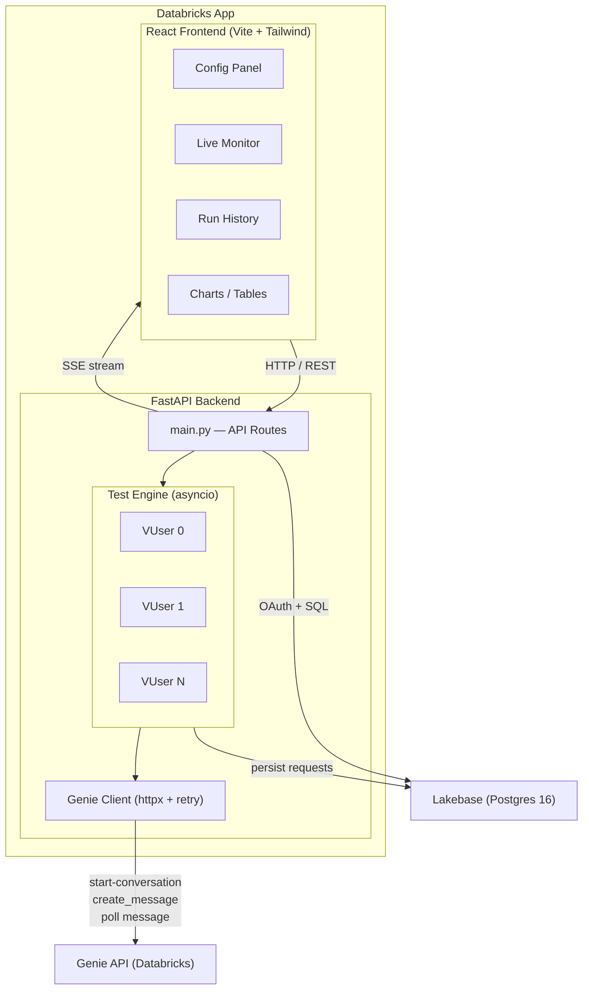
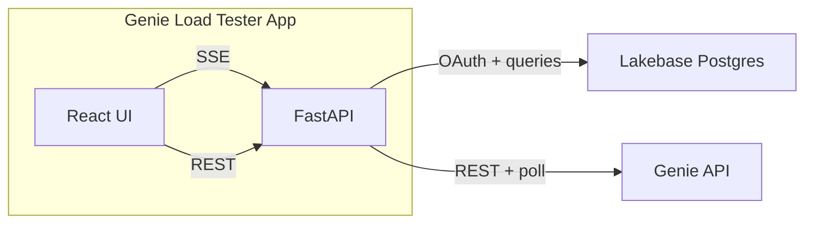
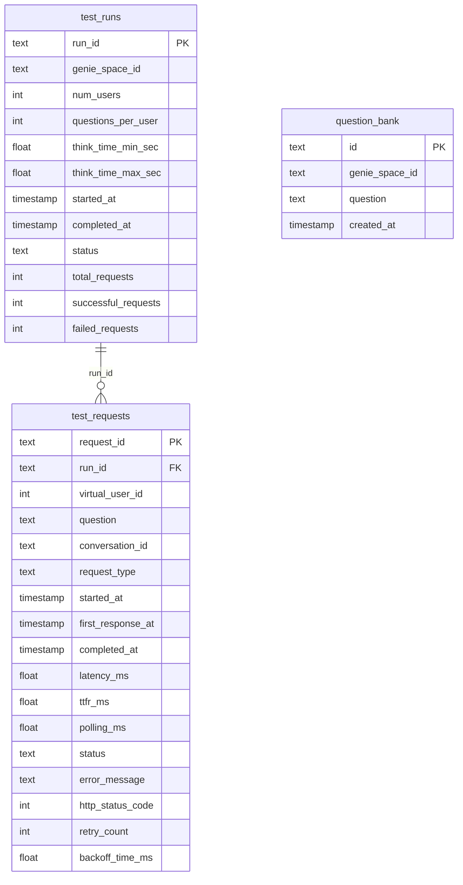
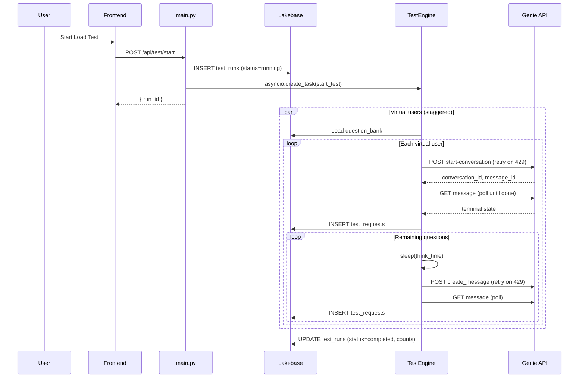
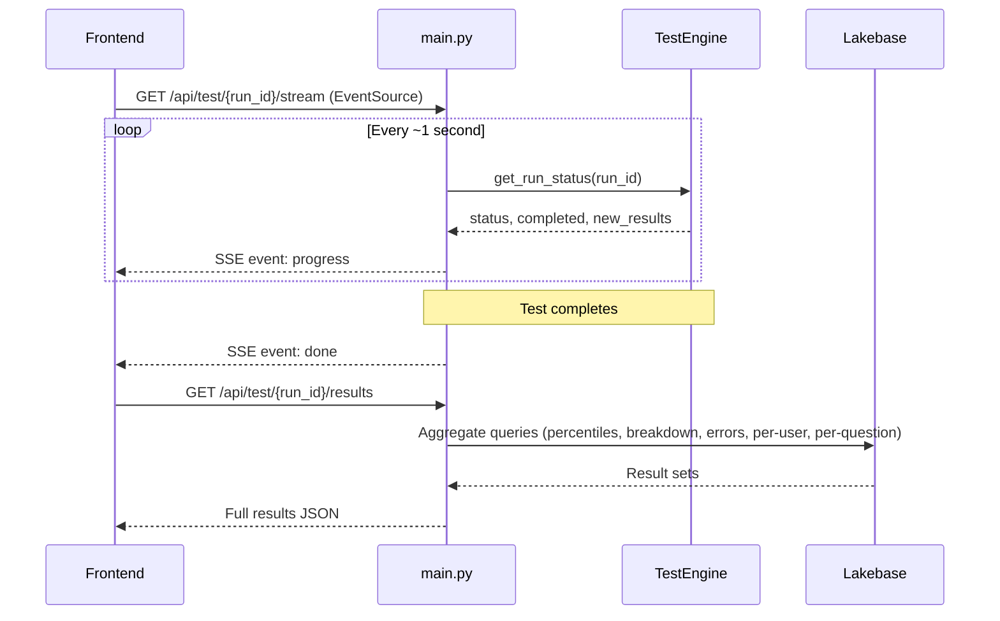
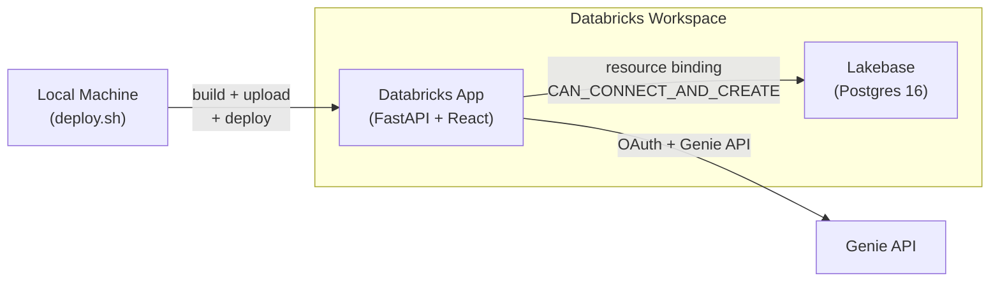

# Architecture

## Overview

Genie Load Tester is a full-stack Databricks App that stress-tests Genie Spaces by simulating concurrent virtual users. It measures end-to-end latency, time to first response (TTFR), polling duration, retry behavior, and throughput — providing the data needed to tune Genie Space instructions and understand API capacity limits.

**Diagrams in this doc:** [System & external deps](#system-diagram) · [Components](#components) · [Database ER](#database-lakebase) · [Test execution sequence](#test-execution-flow) · [SSE monitoring sequence](#real-time-monitoring-flow) · [Deployment](#deployment)

## System Diagram

### External Dependencies

## Components

### Frontend (React)

Single-page app built with Vite, Tailwind CSS, and Recharts. Served as static files by FastAPI.

| Component | Purpose |
|-----------|---------|
| `App.jsx` | Main layout, test configuration panel, tab navigation |
| `LiveMonitor.jsx` | Real-time test progress via SSE, live latency chart |
| `RunHistory.jsx` | Side-panel layout: scrollable run list + detail/compare view |
| `QuestionBank.jsx` | CRUD for questions per Genie Space |
| `MetricCard.jsx` | Reusable metric display with dual ms/seconds format |
| `PercentileChart.jsx` | Bar chart of latency percentiles (P30-P99) |
| `LatencyScatter.jsx` | Scatter plot of latency over time (success vs failed) |
| `LatencyBreakdown.jsx` | Stacked bar: TTFR vs Polling by request type |
| `ThroughputPanel.jsx` | Duration, RPM, success rate, total backoff |
| `ErrorAnalysis.jsx` | Pie chart + table of status distribution |
| `PerUserTable.jsx` | Per virtual user performance breakdown |
| `PerQuestionTable.jsx` | Per question latency (for instruction tuning) |
| `CompareChart.jsx` | Side-by-side percentile comparison of multiple runs |

### Backend (FastAPI)

#### `main.py` — API Routes

- **Test lifecycle:** Start, cancel, stream progress (SSE), list runs, get results, compare runs
- **Question bank:** CRUD operations for managing test questions per Genie Space
- **Static serving:** Serves the built React app, with SPA fallback routing

#### `test_engine.py` — Virtual User Orchestration

The test engine manages concurrent virtual users using Python's `asyncio`:

1. Loads questions from the question bank for the given Genie Space
2. Creates N async tasks (one per virtual user), staggered by 0.5-2s to avoid thundering herd
3. Each virtual user:
   - Calls `start_conversation` with the first question (establishes a Genie conversation)
   - Sends remaining questions via `create_message` within that conversation
   - Waits a random "think time" between questions
   - Records timing metrics for every request
4. Results are accumulated in memory and written to Lakebase per-request
5. Status is exposed to the SSE stream for real-time frontend updates

#### `genie_client.py` — Genie API Client

Handles communication with the Databricks Genie API:

- **Authentication:** Uses `databricks-sdk` WorkspaceClient for OAuth token management
- **Endpoints called:**
  - `POST /api/2.0/genie/spaces/{id}/start-conversation` — Start a new conversation
  - `POST /api/2.0/genie/spaces/{id}/conversations/{cid}/messages` — Send follow-up message
  - `GET /api/2.0/genie/spaces/{id}/conversations/{cid}/messages/{mid}` — Poll for completion
- **Retry strategy:** Configurable exponential backoff on HTTP 429 (rate limited)
  - Formula: `base_delay * (2 ^ attempt)` (ignores server Retry-After header)
  - Default: 2s, 4s, 8s, 16s, 32s
- **Polling:** Checks message status every 2s, times out after 300s
- **Metrics tracked:** start_time, first_response_time, completed_time, retry_count, backoff_time_ms

#### `db.py` — Database Layer

- **Connection:** psycopg v3 with ConnectionPool
- **Auth:** Custom `OAuthConnection` subclass that calls `database.generate_database_credential()` on each new connection, providing fresh OAuth tokens
- **Schema:** Auto-initializes tables on startup with `CREATE TABLE IF NOT EXISTS` and migration `ALTER TABLE ADD COLUMN IF NOT EXISTS`

### Database (Lakebase)

Provisioned Postgres 16 instance managed by Databricks. Three tables:

#### `test_runs`
| Column | Type | Description |
|--------|------|-------------|
| run_id | TEXT PK | UUID for the test run |
| genie_space_id | TEXT | Target Genie Space |
| num_users | INT | Number of virtual users |
| questions_per_user | INT | Questions per user |
| think_time_min_sec | FLOAT | Min think time |
| think_time_max_sec | FLOAT | Max think time |
| started_at | TIMESTAMP | Run start time |
| completed_at | TIMESTAMP | Run completion time |
| status | TEXT | running / completed / failed / cancelled |
| total_requests | INT | Total requests made |
| successful_requests | INT | Successful completions |
| failed_requests | INT | Failed requests |

#### `test_requests`
| Column | Type | Description |
|--------|------|-------------|
| request_id | TEXT PK | UUID per request |
| run_id | TEXT FK | Parent test run |
| virtual_user_id | INT | Which virtual user |
| question | TEXT | The question asked |
| conversation_id | TEXT | Genie conversation ID |
| request_type | TEXT | start_conversation or create_message |
| started_at | TIMESTAMP | Request start |
| first_response_at | TIMESTAMP | First API response received |
| completed_at | TIMESTAMP | Final completion |
| latency_ms | FLOAT | Total end-to-end latency |
| ttfr_ms | FLOAT | Time to first response |
| polling_ms | FLOAT | Time spent polling for completion |
| status | TEXT | completed / error / timeout / failed |
| error_message | TEXT | Error details if failed |
| http_status_code | INT | HTTP status from Genie API |
| retry_count | INT | Number of 429 retries |
| backoff_time_ms | FLOAT | Total time spent in backoff |

#### `question_bank`
| Column | Type | Description |
|--------|------|-------------|
| id | TEXT PK | UUID |
| genie_space_id | TEXT | Associated Genie Space |
| question | TEXT | The question text |
| created_at | TIMESTAMP | When added |

## Data Flow

### Test Execution Flow

### Real-Time Monitoring Flow

## Deployment

### Topology

### How deploy.sh Works

The app is deployed via a shell script (`deploy.sh`) that handles the build-upload-deploy pipeline:

1. **Preflight checks** — Validates CLI tools, auth profile, app exists, no pending deploy
2. **Build frontend** — Runs `npm install && npm run build` in `frontend/`, outputs to `backend/static/`
3. **Stage runtime files** — Copies only what the app needs to a temp directory:
   - `app.yaml`, `requirements.txt`, `backend/` (including built static assets)
   - This avoids uploading frontend source, `node_modules`, docs, etc.
4. **Upload** — `databricks workspace import-dir` pushes the staged files (~10 files, ~700KB)
5. **Deploy** — `databricks apps deploy` triggers the Databricks platform to install dependencies and start the app

The Lakebase database is provisioned separately and bound to the app as a resource, which auto-populates all PG connection environment variables (`PGHOST`, `PGPORT`, `PGDATABASE`, `PGUSER`, `PGSSLMODE`, `PGAPPNAME`) in the app runtime.

## Key Design Decisions

1. **Exponential backoff (not server Retry-After):** Genie returns `Retry-After: 60` which is too conservative for load testing. We use our own `base_delay * 2^attempt` so backoff is configurable per run and allows faster recovery.

2. **Conversation reuse:** Each virtual user starts one conversation, then sends follow-up messages within it. This tests the realistic pattern of Genie usage rather than creating a new conversation per question.

3. **Staggered user starts:** Virtual users are launched with 0.5-2s jitter to avoid a thundering herd on the first request wave.

4. **In-memory + DB recording:** Test progress is tracked in-memory (for fast SSE streaming) and simultaneously written to Lakebase per-request (for durable analytics). Final aggregations use SQL percentile functions.

5. **OAuth token refresh per connection:** The psycopg `OAuthConnection` subclass generates a fresh token for each new pool connection, handling the 1-hour token expiry automatically.

6. **Per-question metrics:** Surfaces which specific questions are slow, enabling targeted Genie instruction tuning rather than blind optimization.
